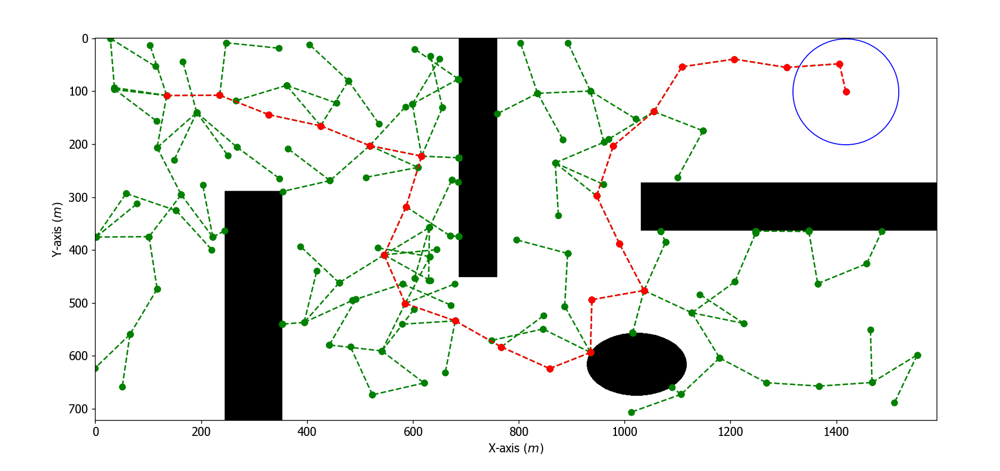
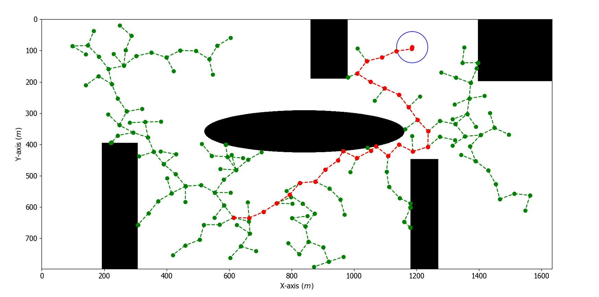
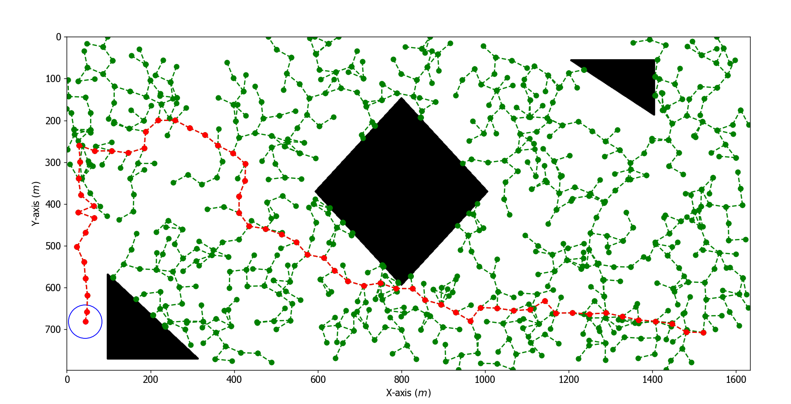
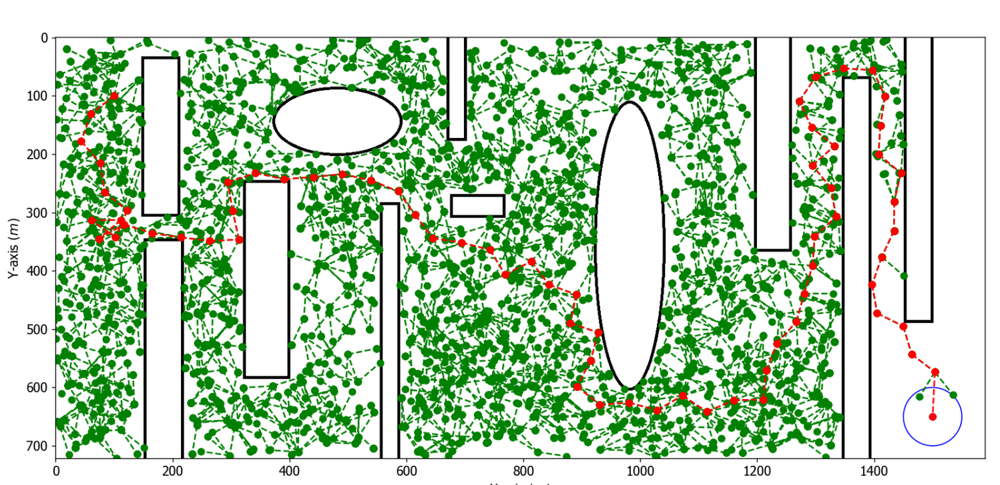
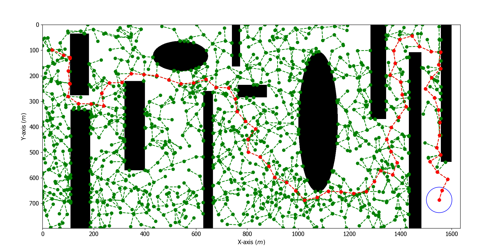

# RRT
## RRT Project — Robot Path Planning

- This project implements the **RRT (Rapidly-exploring Random Tree)** algorithm for 2D robot path planning using **Python**, **NumPy**, and **Matplotlib**.
- The goal is to compute an efficient path from a **start position** to a **target goal**, while **avoiding obstacles** on a grid-based map.

## Setup

1. Create a virtual environment:  
   `python -m venv .venv`
2. Activate the virtual environment:  
   `.venv\Scripts\activate`
3. Install all dependencies from requirements.txt:  
   `pip install -r requirements.txt`

## How to Run
 
- To execute the main script, use the following command: `python main.py`
- At runtime, you will be prompted to select a grid number (1-11).
- Then, the algorithm will attempt to compute and visualize a path from start to goal in real-time using Matplotlib.

## Create Your Own Map

- You can create **custom environments** by drawing your own maps! Use **Paint** (or any image editor) to design your environment. The program will interpret the **black colored shapes as obstacles**, and the white area as free space.
- Once your map is saved, it will be processed and added to the [`test_images`](test_images/) folder.
- For more help with creating and using custom maps, check:  **`readImages.py`** and **`plotting.py`**

##  RRT Algorithm in Action

- Below are some examples of the **RRT algorithm** successfully finding a path in different custom maps:

- You can explore more results and visualizations in the [`result_images`](result_images/) folder.

## Optimization

- We made several optimizations to the basic RRT implementation.
- These changes make the algorithm find a path **faster** and **more efficiently**, especially in more complex environments.
- More details about the changes can be found in the [Documentation](#documentation) section.
&nbsp;  
This test was done with the classic RRT algorithm, before the improvements.
  
*Before improvements*
&nbsp;  
This test was done with the improved RRT algorithm.
  
*After improvements*

## Documentation

- The full project documentation can be found in the [`presentation`](presentation/) folder.
- There you will find both the **Romanian** and **English** versions, with explanations about the **RRT algorithm** and the **improvements that were made**.

## References

We used multiple sources of information to better understand the concepts behind the RRT algorithm and to successfully implement this project.

Here are some of the most useful resources we referenced:

- [Rapidly-Exploring Random Trees (Carnegie Mellon Lecture PDF)](https://www.cs.cmu.edu/~motionplanning/lecture/lec20.pdf)
- [F1TENTH Lecture: RRT Path Planning (CourseKit Docs)](https://f1tenth-coursekit.readthedocs.io/en/stable/lectures/ModuleD/lecture14.html)
- [RRT Algorithm Explained – YouTube](https://youtu.be/OXikozpLFGo?feature=shared)
- [RRT Path Planning Visualized – YouTube](https://youtu.be/Ob3BIJkQJEw)
- [Medium Article: Robotic Path Planning — RRT and RRT\*](https://theclassytim.medium.com/robotic-path-planning-rrt-and-rrt-212319121378)
- [Path Planning Algorithms Playlist – YouTube](https://www.youtube.com/watch?v=-fePRPyeKnc&list=PLn8PRpmsu08qQorl_KLrSns9jI827aplS)

